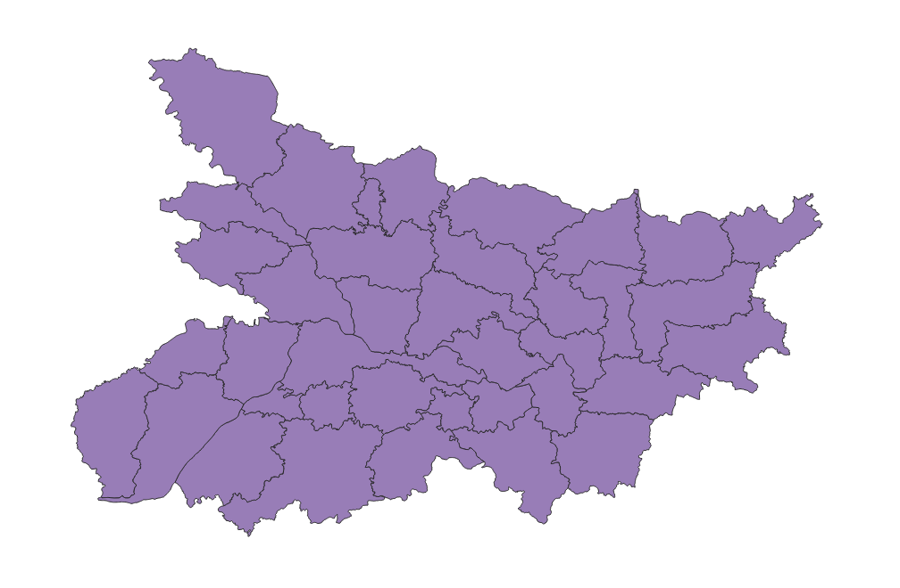
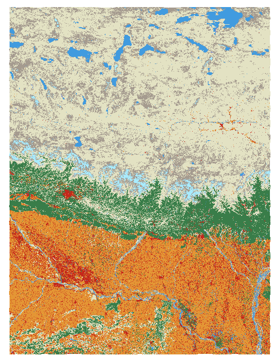
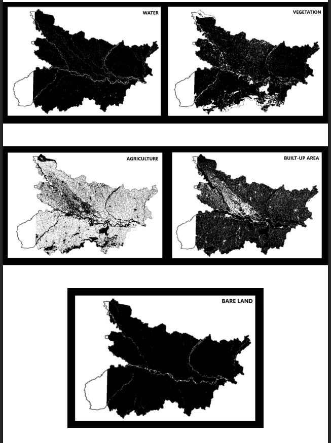

# Land Use Land Cover Classification and Spatial Analysis of Bihar Using QGIS

## Project Overview

This project presents a Land Use Land Cover (LULC) classification and spatial analysis of Bihar using the ESRI Global Land Cover dataset (10 m resolution) in QGIS. The workflow involved raster reclassification of detailed land cover classes into broader categories, followed by binary classification to isolate individual land cover types for class-specific analysis.

The project demonstrates the application of GIS techniques for land cover mapping, spatial analysis, and visualization.

## Study Area

Bihar, India

## Original ESRI LULC Dataset

## Reclassified LULC Map

The original land cover classes were reclassified into the following major categories:

- Water Bodies
- Vegetation
- Agriculture
- Built-up Area
- Bare Land

Binary classification rasters were generated for each major land cover class by separating the target class from all other land cover categories.

- Water vs Non-Water
- Vegetation vs Non-Vegetation
- Agriculture vs Non-Agriculture
- Built-up Area vs Non-Built-up Area
- Bare Land vs Non-Bare Land

## Binary Classification Outputs

## Dataset

- ESRI Global Land Cover Dataset (2024)
- Spatial Resolution: 10 m
- Study Area: Bihar, India

## Software and Tools Used

- QGIS
- Semi-Automatic Classification Plugin (SCP)
- Raster Calculator
- Raster Reclassification Tools
- QGIS Layout Manager

## Methodology

1. Downloaded ESRI LULC raster dataset.
2. Imported raster into QGIS.
3. Examined existing land cover classes.
4. Reclassified detailed classes into:
   - Water Bodies
   - Agricultural Area
   - Vegetation
   - Built-up Areas
   - Barren Land
5. Generated binary classification rasters for individual classes.
6. Generated thematic maps.
7. Calculated area statistics for each class.

## Results

The reclassified land cover map of Bihar revealed the following distribution:

| Class | Area (km²) | Percentage |
|---------|---------|---------|
| Agriculture | 59,650 | 67.74% |
| Built-up Area | 16,490 | 18.72% |
| Vegetation | 9,205 | 10.45% |
| Water Bodies | 1,823 | 2.07% |
| Bare Land | 896 | 1.02% |

Total Area Analyzed: 88,056 km²
## Skills Demonstrated

- GIS Analysis
- LULC Analysis
- Raster Processing
- Raster Reclassification
- Binary Classification
- Spatial Analysis
- Cartographic Visualization
- QGIS
  
Siddharth Gupta

B.Tech Geoinformatics

Netaji Subhas University of Technology (NSUT)
